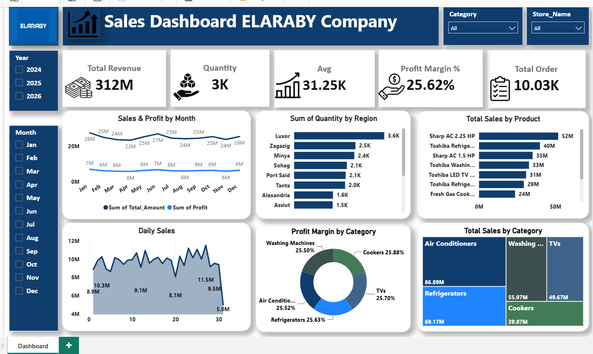

# 📊 Sales &amp; Profitability Dashboard — Appliance Retail (ELARABY)
### End-to-End Power BI Analytics Solution

---

## 📌 Overview

An interactive, single-page Power BI dashboard built to track sales, quantity, profit margin, and order volume for a home appliance retail business across multiple stores and regions in Egypt. The dashboard consolidates revenue, profitability, and product-level performance into one live view for management decision-making.

## 🎯 Business Problem

Management needed a single, up-to-date view of sales performance across regions, product categories, and stores — broken down by month and by year — to quickly identify top-performing products/regions and monitor profit margin by category, instead of relying on scattered manual reports.

## 🛠️ Tools &amp; Technologies

<table>
<tr><td><b>BI Tool</b></td><td>Power BI Desktop &amp; Service</td></tr>
<tr><td><b>Data Modeling</b></td><td>DAX measures (Total Revenue, Profit Margin %, Avg Order Value)</td></tr>
<tr><td><b>Data Prep</b></td><td>Power Query (M Language)</td></tr>
<tr><td><b>Data Sources</b></td><td><!-- [ADD: e.g. Excel exports, SQL Server, ERP system] --></td></tr>
</table>

## ✨ Key Features

- **KPI Summary Cards** — Total Revenue, Quantity Sold, Average Order Value, Profit Margin %, and Total Orders at a glance.
- **Interactive Filters** — Slice the dashboard by Category, Store Name, Year (2024–2026), and Month.
- **Sales &amp; Profit Trend** — Dual-line monthly chart comparing total sales amount vs. profit over time.
- **Regional Performance** — Bar chart breaking down quantity sold across 8 regions (Luxor, Zagazig, Minya, Sohag, Port Said, Tanta, Alexandria, Assiut).
- **Product-Level Ranking** — Top-selling products (air conditioners, refrigerators, washing machines, TVs, cookers) ranked by total sales.
- **Daily Sales Trend** — Area chart tracking day-by-day sales fluctuation within the selected period.
- **Profit Margin by Category** — Donut chart comparing margin % across 5 product categories.
- **Sales by Category (Treemap)** — Visual size-based comparison of total sales contribution per category.

## 📈 Dashboard Preview

## 📑 Full Presentation

📎 [View the full project presentation](

## 🔍 Approach

1. **Data Preparation** — Cleaned and transformed raw sales transaction data using Power Query, structuring it into a star-schema-friendly model (fact table for sales, dimension tables for product, store, region, and date).
2. **Data Modeling** — Built DAX measures for revenue, profit margin %, average order value, and quantity, with proper relationships between fact and dimension tables.
3. **Dashboard Design** — Designed a single-page layout combining KPI cards, trend charts, regional breakdowns, and category-level profitability visuals for fast executive-level scanning.
4. **Interactivity** — Added slicers for category, store, year, and month to let stakeholders drill into any specific segment.

## 📊 Key Results

<!-- [ADD: any outcome you're comfortable sharing publicly, e.g. "Gave management a single source of truth for sales performance, replacing manual spreadsheet consolidation."] -->

## 🔒 Note on Data

This repository showcases the dashboard design, structure, and DAX/Power Query approach only. Figures shown in any published screenshots may be masked or based on representative data — no proprietary company data is shared beyond what is necessary to demonstrate the analytical approach.

---

**Sameh El-Hosary** | Data Analyst &amp; Business Intelligence Analyst
[LinkedIn](https://linkedin.com/in/sameh-el-hosary-) · [GitHub](https://github.com/SamehElhosary0) · [Email](mailto:sameh.sabry656@gmail.com)

